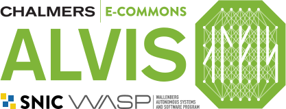

# Open OnDemand (dashboard) Plugins @ C3SE

This repo contains local plugins used at C3SE. This repo organizes our changes
to the dashboard app using plugins which are available since OOD 4.0.


## List of plugins

- `brand`: logos and branding;
- `diskquota`: home and project quota widget pages;
- `projinfo`: project usage page;
- `metrics`: metrics on active jobs and dashboard;


## General setup

Extra UI elements are registered as widgets which can be used in the ood config,
e.g. in `ondemand.d/customizations.yml`:

```diff
  dashboard_layout:
    rows:
+     - columns:
+       - width: 6
+         widgets:
+           - alvis_logo_widget
+           - diskquota_warning
        - width: 6
          widgets:
            - pinned_apps
```

this adds an extra row with the corresponding widgets.

To display some information as a dedicated page, create a custom page and point
a navigation bar element to it.

```diff
  nav_bar:
    - title: "Files"
      links:
        - apps: "sys/files"
+       - title: "Check my quota"
+         page: "diskquota"
+         icon: "fa://pie-chart"
    - clusters
    - interactive apps
    - my interactive sessions
+ custom_pages:
+   diskquota:
+     rows:
+       - columns:
+         - width: 12
+           widgets:
+             - "diskquota_page"
```

The helper functions needed in those view can usually be implemented in the
`lib` sub-folder of each plugin. If a function in an existing module of the
dashboard is to be modified, one can implement that as an override with an
initializer; see `metrics/initializers/active_jobs_helper.rb`.


## Credits

This repo is based on several separate repos. Prior to the adaptation of
4.x-style plugin setup, each functionality is provided as a passenger **app** or
dashboard **mod**ification. These works are mostly done by Linus Nilsson and
Arvid Agne at UPPMAX with misc fixes by staff at C3SE.

- projinto ([mod][projinfo-mod])
- diskquota ([mod][diskquota-mod],[app][diskquota-app]);
- footer tweak ([mod][footer-mod])

[projinfo-mod]: https://github.com/c3se/ood_dashboard_projinfo
[diskquota-mod]: https://github.com/c3se/ood_dashboard_diskquota
[diskquota-app]: https://github.com/c3se/ood_diskquota
[footer-mod]: https://github.com/c3se/ood_dashboard_c3se_footer

The migration and rearrangement of plugins are mostly done by Yunqi Shao at
C3SE, inspired by [HMDC's demonstration at GOOD25][good25].

[good25]: https://github.com/hmdc/good25
